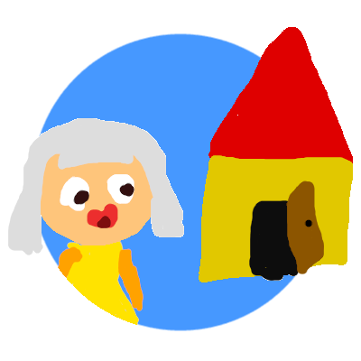

# **GameJam** - Introdução a programação  :video_game:

  

Game desenvolvido com a biblioteca raylib para a cedeira de introdução à programação.
Para compilar o jogo rode o comando "make" dentro da pasta principal.
